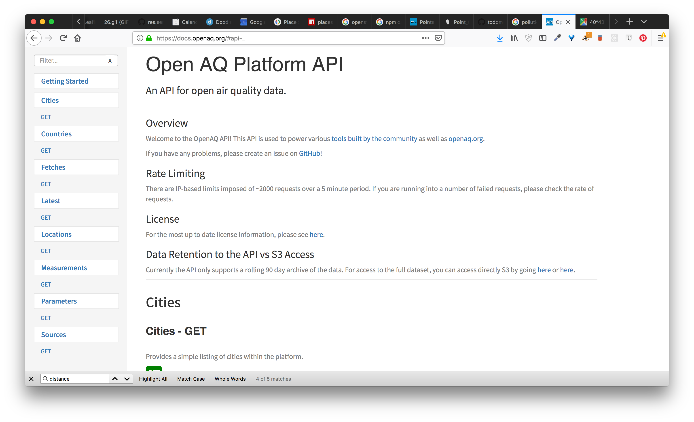

# The Weather Here
> This is a little application that prompts you to "check-in". This application gets your location data then retrieves the weather for that location. On the server, the server queries the OpenAQ - open air quality - database for pollution data within 10km of the given coordinates. You can view your checkins and also a little "story" writted from the contextual data collected from the application. This includes data on the weather, your location, and the pollution in that area if measurements are available. 


## Setup

```sh
cd the-weather-here

npm install

npm start
```
the app will be running at: `http://localhost:3030`


# Highlights


## Handy Libraries:

see: `index.js`
```js
// allow us to use "fetch()" on the server
require('es6-promise').polyfill();
require('isomorphic-fetch');

// our 3rd party apis we want to query
const weather = require('weather-js');
```
* es6-promise: allows us to use es6 promises
* isomorphic-fetch: allows us to use the `fetch()` function on the server. `fetch()` is a function which is a built in browser function for making HTTP requests. For consistency, people have mirrored the functionality for serverside requests.
* weather-js: a library to make it easier to query MSN's weather data API.


### getting weather data on the server


see: `index.js`

```js
// Show submission page
app.get("/weather/:lat/:lng", (req, res) => {
    let latlng = `${req.params.lat},${req.params.lng}`

    let searchOptions = {
        search: latlng, 
        degreeType: 'C'
    }
    
    weather.find(searchOptions, function(err, result) {
        if(err) console.log(err);
        console.log(JSON.stringify(result, null, 2));
        // we get back an array, so we only send the first value
        res.send(result[0]);
      });
    
});
```
- Here whenever people query the endpoint: `/weather/40.679770/-73.961384, then we can get the weather for the location that the person is querying from.

### Making a POST request and querying the air quality data



```js
// accept a payload to this checkin post endpoint
app.post("/checkin", (req, res) => {

    // our unix timestamp
    const unixTimeCreated = new Date().getTime();
    
    // add our unix time as a "created" property and add it to our request.body
    // we receive the location data from the client in the req.body
    const newData = Object.assign({"created": unixTimeCreated}, req.body)

    // QUERY THE OPEN AQ PLATFORM FOR AIR QUALITY DATA
    const searchDistance = 10000; // meters == 10km
    let openAQUrl = `https://api.openaq.org/v1/latest?coordinates=${req.body.location.lat},${req.body.location.lon}&nearest=${searchDistance}`

    fetch(openAQUrl)
        .then(result =>{
            return result.json();
        }).then(result => {
            // add the pollution data to our newData
            // console.log(result)
            newData.pollution = result;

            // insert the data into our db
            db.insert(newData, (err, docs) =>{
                if(err){return err;}
                res.send(docs);
            });

        }).catch(err => {
            return err;
        });
});
```
- Here we accept a POST request. In our POST request, we get the location, and the weather data that was requested earlier.
- The cool thing here that we do is to get the air quality data based on the location that is sent from the client.
- You can see that we structure our query like so: `https://api.openaq.org/v1/latest?coordinates=${req.body.location.lat},${req.body.location.lon}&nearest=${searchDistance}` where the `%{}` is a javascript template literal that allows us to mash up the result of javascript variables with text.


## Our checkin map page!


Using the leaflet.js library, we create a map of our checkins:

see: `/public/checkin/sketch.js`
```js
  // create a leaflet map instance and using the "map" id set in your index.html
  myMap = L.map('map')
          .setView([latestLocation.lat, latestLocation.lon], 10);
  // add your openstreetmap layer to your myMap variable
  const tiles = L.tileLayer('https://{s}.tile.openstreetmap.org/{z}/{x}/{y}.png', {
          attribution: '&copy; <a href="https://www.openstreetmap.org/copyright">OpenStreetMap</a> contributors'
      });
  tiles.addTo(myMap);

  ...

  // for each item in myData, create a circle with a popup
    for (let p in myData) {
        let item = myData[p];
        let location = item.location
        let weather = item.weather;
        let pollution = item.pollution;

        // add a circle to the myMap variable
        let currentCircle = L.circle([location.lat, location.lon], 700, {
            color: "red"
        }).addTo(myMap);

        // add some popup text
        let popUpText = `I'm sitting out here on this ${weather.current.skytext} ${weather.current.day} and it feels like ${weather.current.feelslike}℃ outside.`;
        
        if(pollution){
            popUpText += `\nThe concentration of small carcinogenic particles (pm2.5) I'm breathing in is ${pollution.results[0].measurements[0].value}${pollution.results[0].measurements[0].unit}`
            popUpText += `\nmeasured from ${pollution.results[0].city} at ${pollution.results[0].location}.`
        }
        
        currentCircle.bindPopup(popUpText)
    }
```
- this snippet adds a leafletjs map to the `<main id="map>` tag on out `/public/index.html` 
- the second part of the code renders each point you checked in point to the map. The `L.circle()` function creates a point and the `.addTo(myMap)` function adds it to the map that we called `myMap`.
- if we have pollution data, we add that to the popup that shows on click.


